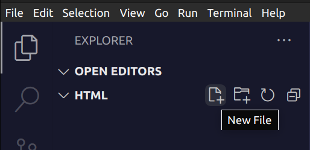
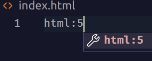

## Curso JavaScript Coder House
## Tutoría: David Leda
 

***

### Instrucciones para instalar Visual Studio Code y Live Server:

#### 1. Ir a la página de Visual Studio Code, descargar la aplicación e instalarla:

[code.visualstudio.com](https://code.visualstudio.com/)

#### 2. Abrir Visual Studio Code y cliquear en el ícono de Extensiones:

#### 3. Buscar la extensión Live Server e instalarla:

#### 4. En Visual Studio Code abrir una carpeta vacía que hayamos creado previamente (Open Folder...): 

#### 5. Crear un nuevo archivo (New File) y llamarlo `index.html`:

#### 6. Crear una maqueta de HTML escribiendo `html:5` y luego presionando la tecla `TAB`:

#### 7. Dentro del body del HTML (`<body>`) crear un tíulo (`<h1>`):

#### 8. Iniciar el servidor para poder ver la página en el navegador (preferentemente Chrome, o el que tengan como navegador por defecto) cliqueando en el ícono Go Live abajo a la derecha:

#### Y ahí deberían poder ver la página en el navegador:

***

